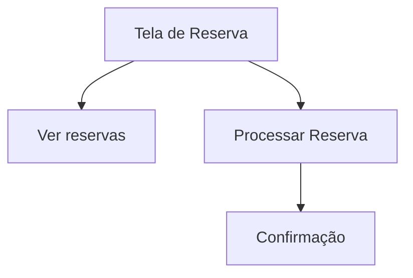

## 1. Product Overview
Sistema de reserva de veículos para viagens corporativas. Interface permite solicitação de reserva com seleção de datas, destinos e condutores.
- Resolve problema de gestão de reservas de veículos internos
- Usado por colaboradores que precisam de transporte para viagens
- Simplifica processo de reserva com interface intuitiva

## 2. Core Features

### 2.1 User Roles
| Role | Registration Method | Core Permissions |
|------|---------------------|------------------|
| Colaborador | Login corporativo | Solicitar reservas, ver histórico |
| Administrador | Designado | Gerenciar reservas, aprovar solicitações |

### 2.2 Feature Module
Nossa tela de reserva consiste nos seguintes módulos principais:
1. **Tela de Reserva**: formulário de solicitação com dados da viagem
2. **Visualização de Reservas**: lista de reservas existentes

### 2.3 Page Details
| Page Name | Module Name | Feature description |
|-----------|-------------|---------------------|
| Tela de Reserva | Cabeçalho | Exibir título "Reserve seu Veículo" e subtítulo explicativo |
| Tela de Reserva | Formulário Principal | Card com campos de preenchimento da reserva |
| Tela de Reserva | Data de Retirada | Seletor de data com ícone de calendário |
| Tela de Reserva | Data de Entrega | Seletor de data com ícone de calendário |
| Tela de Reserva | Destinos da Viagem | Campo de texto para inserir destinos com botão adicional |
| Tela de Reserva | Condutor Principal | Dropdown para seleção do motorista |
| Tela de Reserva | Acompanhantes | Lista de checkboxes para selecionar passageiros (sem nomes) |
| Tela de Reserva | Botão de Ação | Botão "Reservar Veículo" para submeter formulário |
| Tela de Reserva | Botão Secundário | Botão "Ver reservas" para navegação |

## 3. Core Process
**Fluxo de Solicitação de Reserva:**
1. Usuário acessa tela de reserva
2. Preenche data de retirada e entrega
3. Informa destino(s) da viagem
4. Seleciona condutor principal
5. Marca acompanhantes (quando houver nomes)
6. Clica em "Reservar Veículo"
7. Sistema processa solicitação

## 4. User Interface Design

### 4.1 Design Style
- **Cores Primárias**: Azul para botões principais (#0066CC)
- **Cores Secundárias**: Cinza claro para backgrounds (#F5F5F5)
- **Botões**: Arredondados, sombra suave
- **Fontes**: Sans-serif, tamanho 16px para textos, 24px para títulos
- **Layout**: Card centralizado com bordas arredondadas
- **Ícones**: Estilo outline, tamanho 20x20px

### 4.2 Page Design Overview
| Page Name | Module Name | UI Elements |
|-----------|-------------|-------------|
| Tela de Reserva | Cabeçalho | Título centralizado, texto explicativo abaixo, ambos em cor escura |
| Tela de Reserva | Card Principal | Background branco, borda cinza clara, cantos arredondados, padding 24px |
| Tela de Reserva | Seções de Formulário | Ícone à esquerda, label acima do input, inputs com borda arredondada |
| Tela de Reserva | Botão Principal | Background azul, texto branco, largura total do card, altura 48px |
| Tela de Reserva | Botão Secundário | Background cinza claro, texto escuro, posicionado acima do card |

### 4.3 Responsiveness
- Design desktop-first
- Adaptável para tablets e mobile
- Touch-friendly em dispositivos móveis