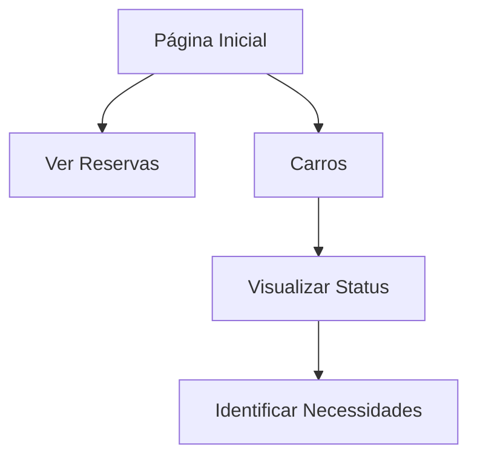

## 1. Product Overview
Sistema de reserva e gestão de carros para empresa agrícola. Permite visualizar reservas existentes e gerenciar frota de veículos com acompanhamento de status e manutenção.
- Problema: Gestão manual de reservas e manutenção de carros
- Usuários: Funcionários da empresa que precisam reservar carros
- Solução: Interface simples para reservas e monitoramento de status da frota

## 2. Core Features

### 2.1 User Roles
| Role | Registration Method | Core Permissions |
|------|---------------------|------------------|
| Funcionário | Login corporativo | Visualizar reservas, ver status dos carros |
| Administrador | Designado | Gerenciar reservas, atualizar status dos carros |

### 2.2 Feature Module
O sistema consiste nas seguintes páginas principais:
1. **Página Inicial**: Navegação principal, acesso às funcionalidades
2. **Ver Reservas**: Lista de reservas ativas com detalhes
3. **Carros**: Lista de veículos com status de revisão e tanque

### 2.3 Page Details
| Page Name | Module Name | Feature description |
|-----------|-------------|---------------------|
| Página Inicial | Navegação | Apresentar botões principais: "Ver reservas" e "Carros" |
| Ver Reservas | Lista de Reservas | Exibir reservas com data, veículo, responsável e status |
| Carros | Lista de Carros | Mostrar todos os veículos com placa, modelo, ano, status de revisão e nível do tanque |
| Carros | Indicadores de Status | Visualizar com cores/ícones se carro precisa de revisão ou está com tanque baixo |

## 3. Core Process
### Fluxo do Usuário
1. Usuário acessa página inicial
2. Usuário clica em "Ver reservas" ou "Carros"
3. Se clicar em "Carros": visualiza lista completa da frota com status
4. Usuário identifica carros que precisam de atenção (revisão/tanque)

## 4. User Interface Design
### 4.1 Design Style
- Cores principais: Verde empresa (#2E7D32), cinza claro (#F5F5F5)
- Botões: Estilo retangular com bordas arredondadas (8px)
- Fonte: Arial ou system font, tamanho 14px para texto, 18px para títulos
- Layout: Baseado em cards com sombra sutil
- Ícones: Sistema de cores para status (verde=ok, amarelo=atenção, vermelho=critico)

### 4.2 Page Design Overview
| Page Name | Module Name | UI Elements |
|-----------|-------------|-------------|
| Página Inicial | Botões principais | Dois botões grandes lado a lado: "Ver reservas" e "Carros", ícones representativos |
| Carros | Lista de veículos | Cards horizontais com placa destacada, modelo/ano em texto menor, badges coloridos para status |
| Carros | Indicadores | Ícone de ferramenta para revisão, ícone de gasolina para tanque, cores variam conforme status |

### 4.3 Responsiveness
Desktop-first com adaptação para tablets. Em mobile, botões empilham verticalmente e cards ocupam largura total.