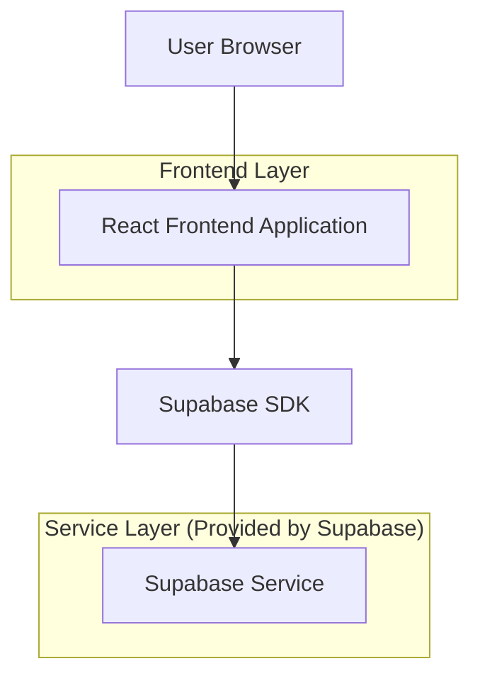
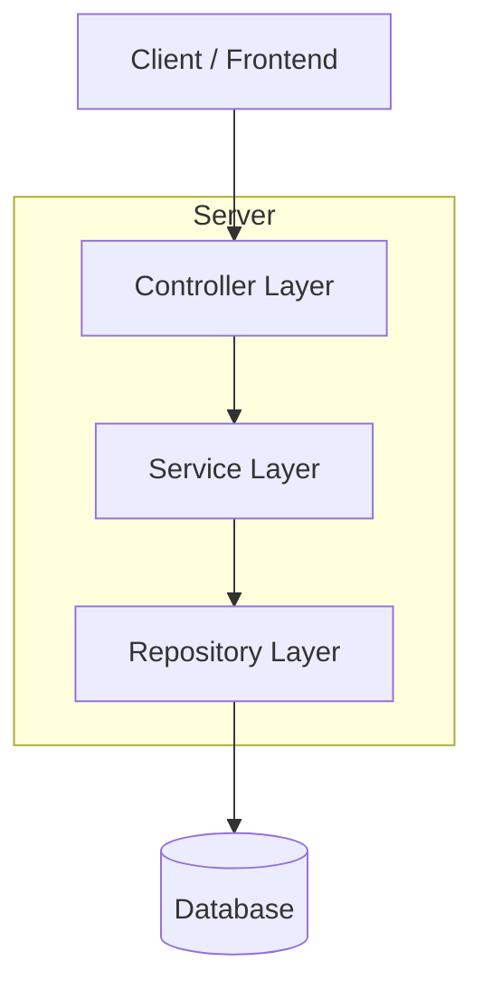
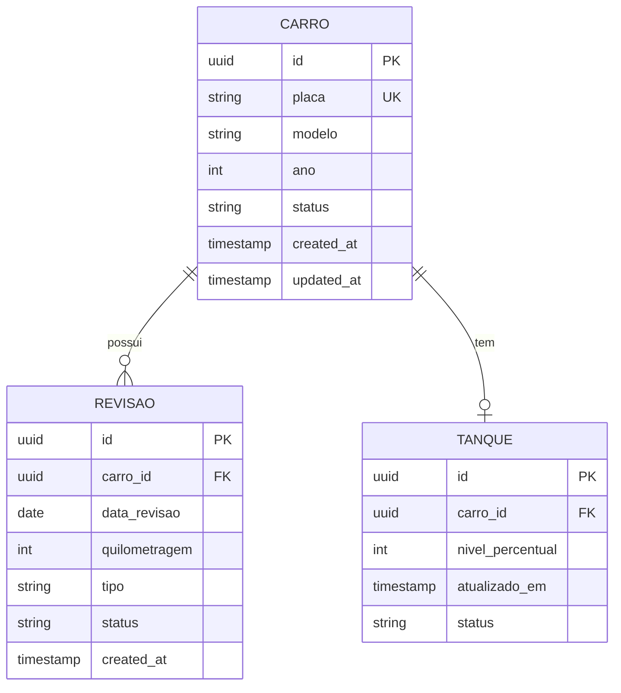

## 1.Architecture design



## 2.Technology Description
- Frontend: React@18 + tailwindcss@3 + vite
- Initialization Tool: vite-init
- Backend: Supabase (Authentication + Database + Storage)

## 3.Route definitions
| Route | Purpose |
|-------|---------|
| / | Página inicial com navegação para funcionalidades |
| /reservas | Lista de reservas de veículos |
| /carros | Lista de veículos com status e indicadores |

## 4.API definitions

### 4.1 Core API

Gestão de carros
```
GET /api/carros
```

Response:
| Param Name| Param Type  | Description |
|-----------|-------------|-------------|
| carros    | array       | Lista de veículos |
| id        | string      | ID único do carro |
| placa     | string      | Placa do veículo |
| modelo    | string      | Modelo do veículo |
| ano       | number      | Ano de fabricação |
| revisao   | object      | Status de revisão |
| tanque    | object      | Status do tanque |

Example
```json
{
  "carros": [
    {
      "id": "uuid-123",
      "placa": "ABC-1234",
      "modelo": "Toyota Hilux",
      "ano": 2022,
      "revisao": {
        "status": "pendente",
        "data_proxima": "2024-01-15",
        "quilometragem_atual": 45000
      },
      "tanque": {
        "nivel": 25,
        "status": "baixo"
      }
    }
  ]
}
```

## 5.Server architecture diagram


## 6.Data model

### 6.1 Data model definition


### 6.2 Data Definition Language

Tabela de Carros (carros)
```sql
-- create table
CREATE TABLE carros (
    id UUID PRIMARY KEY DEFAULT gen_random_uuid(),
    placa VARCHAR(10) UNIQUE NOT NULL,
    modelo VARCHAR(100) NOT NULL,
    ano INTEGER NOT NULL,
    status VARCHAR(20) DEFAULT 'disponivel' CHECK (status IN ('disponivel', 'manutencao', 'reservado')),
    created_at TIMESTAMP WITH TIME ZONE DEFAULT NOW(),
    updated_at TIMESTAMP WITH TIME ZONE DEFAULT NOW()
);

-- create index
CREATE INDEX idx_carros_status ON carros(status);
CREATE INDEX idx_carros_placa ON carros(placa);

-- permissões
GRANT SELECT ON carros TO anon;
GRANT ALL PRIVILEGES ON carros TO authenticated;
```

Tabela de Revisões (revisoes)
```sql
-- create table
CREATE TABLE revisoes (
    id UUID PRIMARY KEY DEFAULT gen_random_uuid(),
    carro_id UUID REFERENCES carros(id) ON DELETE CASCADE,
    data_revisao DATE NOT NULL,
    quilometragem INTEGER NOT NULL,
    tipo VARCHAR(50) DEFAULT 'preventiva' CHECK (tipo IN ('preventiva', 'corretiva', 'troca_oleo')),
    status VARCHAR(20) DEFAULT 'pendente' CHECK (status IN ('pendente', 'concluida', 'atrasada')),
    created_at TIMESTAMP WITH TIME ZONE DEFAULT NOW()
);

-- create index
CREATE INDEX idx_revisoes_carro_id ON revisoes(carro_id);
CREATE INDEX idx_revisoes_status ON revisoes(status);

-- permissões
GRANT SELECT ON revisoes TO anon;
GRANT ALL PRIVILEGES ON revisoes TO authenticated;
```

Tabela de Tanque (tanque_status)
```sql
-- create table
CREATE TABLE tanque_status (
    id UUID PRIMARY KEY DEFAULT gen_random_uuid(),
    carro_id UUID REFERENCES carros(id) ON DELETE CASCADE,
    nivel_percentual INTEGER CHECK (nivel_percentual >= 0 AND nivel_percentual <= 100),
    atualizado_em TIMESTAMP WITH TIME ZONE DEFAULT NOW(),
    status VARCHAR(20) GENERATED ALWAYS AS (
        CASE 
            WHEN nivel_percentual <= 15 THEN 'critico'
            WHEN nivel_percentual <= 30 THEN 'baixo'
            WHEN nivel_percentual <= 70 THEN 'medio'
            ELSE 'alto'
        END
    ) STORED
);

-- create index
CREATE INDEX idx_tanque_carro_id ON tanque_status(carro_id);
CREATE INDEX idx_tanque_status ON tanque_status(status);

-- permissões
GRANT SELECT ON tanque_status TO anon;
GRANT ALL PRIVILEGES ON tanque_status TO authenticated;
```