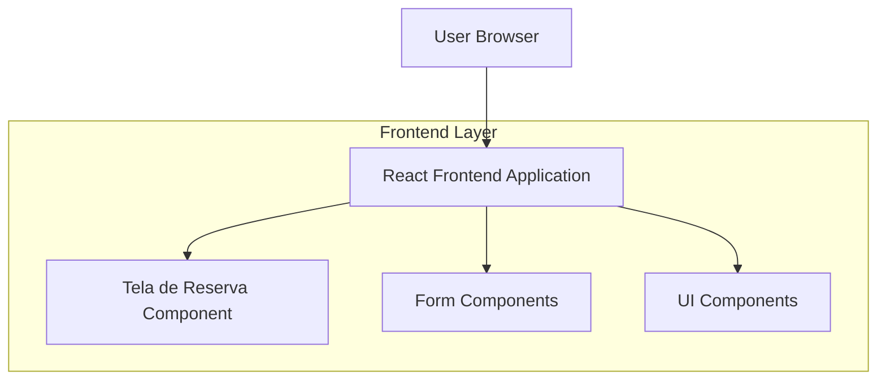

## 1. Architecture design



## 2. Technology Description
- Frontend: React@18 + tailwindcss@3 + vite
- Initialization Tool: vite-init
- Backend: None (visual apenas)
- Estado: React Hooks (useState, useEffect)

## 3. Route definitions
| Route | Purpose |
|-------|---------|
| / | Tela de Reserva, formulário principal |
| /reservas | Lista de reservas existentes |

## 4. Component Structure

### 4.1 Core Components
```typescript
interface ReservationForm {
  pickupDate: string;
  returnDate: string;
  destinations: string[];
  mainDriver: string;
  companions: string[];
}

interface FormField {
  label: string;
  placeholder: string;
  icon: string;
  type: 'date' | 'text' | 'select' | 'checkbox';
}
```

### 4.2 Component Hierarchy
- App
  - Header
    - Title: "Reserve seu Veículo"
    - Subtitle: descrição do sistema
  - ReservationCard
    - FormSection (Data de Retirada)
    - FormSection (Data de Entrega)
    - FormSection (Destinos)
    - FormSection (Condutor Principal)
    - FormSection (Acompanhantes)
    - SubmitButton
  - SecondaryActions
    - ViewReservationsButton

## 5. State Management
- Estado local com React Hooks
- Form state para dados da reserva
- UI state para loading e erros
- No backend integration (visual apenas)

## 6. Styling Approach
- Tailwind CSS para estilização
- Componentes reutilizáveis
- Design system com cores consistentes
- Responsividade mobile-first